# python Embedded
Python erleichtert den Einstieg in das Entwickeln von Embedded Anwendungen.
## Embedded?
Mit dem Stickwort Embedded werden meistenes Geräte verstanden die fuer spezielle Anwedungen designed werden jedoch mindestens eine APU (Application Processing Unit) haben und angeschlossenen Geräten wie etwa Sensoren steuern. Die Steuerung erfolgt wie immer wenn  Typische Beispiele sind:
### Roboter  

hier spielen eine vielzahl von Sensoren mit der Steuerung der Motoren des Roboters zusammen. Maschine Learning oder Deep Learning kommen zum Einsatz um den Steuerungsprozess zu vereinfachen. Aber Vorsicht, Das entwickeln solcher Ansaetze ist sehr aufwändig.
### Autos

Etwa in der Motorsteuerung, Assistenz-Systemen oder Infotainment. 
### Hashaltsgeräten, wie etwa Öfen, Kühlschränken, Küchenmaschinen

### Öffentliche Infrastruktur

© SWO Netz GmbH / M.K.

Parkplatzüberwachung, Ampelsteuerung, Umspannwerken, Durchflussüberwachung für Wasser oder Gas leitungen, etc.

Diese Liste liesse sich beliebig ausweiten und soll nur veranschaulichen das Software und APUs heute überall zu finden sind, nicht nur in den vielleicht offensichtlicheren Anwendungen wie Smarthomes oder Homecomputer.

# Embedded? Embedded!
Durch die Makersceene und projekten wie Ardunio ist das Entwickeln von Embedded Anwendungen heute nicht mehr nur möglich für Ingenieur*Innen oder Informatiker*Innen sondern gibt es viel Möglichkeiten für Hobby Projekte einen Einstieg in das Thema zu finden. 

## BBC micro:bit v2
Geräde für Menschen die etwas Erfahrung mit python (aber auch in anderen Sprachen wie rust oder c) gesammelt haben und sich in der Embeddes Entwicklung versuchen wollen, ist der micro:bit ein sehr guter Einstieg.

* Viele Beispiele
* Nützliche Sensoren und Geräte an Board
* Günstig (~20 €)
* Einfach zu nutzendes Programmier Interface
* Gute Dokumentation

### Specs
| Type | Component | Comment |
|---|---|---|
| MPU | Nordic nRF52833 | Arm Cortex-M4 |
|  | on-chip | 2.4 GHz transceiver |
|  | Nordic S140 | Bluetooth 5.1 with BLE |
| | on-board & chip | 12bit ADC |
| | on-chip | temperatur Sonsor |
| USB | NXP KL27Z | USB 2.0 | 
|     | | Contains Arm Cortex-M0 |
| Audio | MLT-8530 | Speaker |
|       | SPU0410LR5H-QB-7 | Microphone |
| Motion Sensor | LSM303AGR | 3x3 Motion Senor |
| on-board | | LEDs |


## Arduino Uno Rev 3.
Sehr beliebt in der Maker Scene. Kein Python Support (Erst by Boards wie Ardunio Nano oder Giga als auch Portenta h7).

* Sehr viele Beispiele
* Sehr viele Erweiterungsboards
* Risen Community
* Günstig (~25 €)
* Open Source Hardware

### Specs
| Type | Component | Comment |
|---|---|---|
| MPU | ATmega328 | 8-bit AVR |
|  | on-board & chip | 6 x 10bit ADC / 4 x 10bit DAC |
|  | on-board | 6 x 8-bit PWM out |
| | on-board | 14 digital Pins |
| Coprocessor | ATmega16U2 |  | 
|     | on-chip | Power-Control |
| on-board | | USB-B (USB 1.0) |
| on-board | | LEDs |

## Raspberry PI 4 Modul B
Vergleichbar mit Homecomputer, mit GPU und Betriebssystem.

* Schnelle CPU
* ~ 45-100 €
* Linux / Windows
    * Full Python support
* Graphics Card in SoM
* 64 bit
### Specs
| Type | Component | Comment |
|---|---|---|
| MPU | Broadcom BCM2711 | quad-Core ARM Cortex-A72 |
|  | on-chip | Broadcom VidepCore IV |
|  | on-chip | video codec acceleration |
|  | on-board * chip | gigabit-ethernet |
|  | on-board | 2x micro hdmi |
| on-board | | dsi display and camera conn |
| on-board | | dsi display and camera conn |
| on-board | | 40-pin digital IO |
| on-board | | LEDs |

## Coral Dev Board Micro
Auf Machine Learning spezialisiertes Board. Später mehr dazu.

* Neu am Markt
* ~100€
* FreeRTOS
* TPU
### Specs
| Type | Component | Comment |
|---|---|---|
| MPU | NXP i.MX RT1176 | Cortex M7 and M4 |
|  | on-chip | 2D Acceleration |
|  | on-chip | video codec acceleration |
|  | on-board | 2 x 12 IO Ports for PWM, UART, I2C, ADC, DAC, ... |
| on-board | DF40C-100DP-0.4V | 2x 100 pin Board to Board |
| TPU | Coral Edge TPU coprocessor | High performance inferencing for TF Lite models |
| Camera | HM01B0 CMOS sensor | 324 x 324 on board Camera |
| Microphone | on-board | PDM Mono Microphone |

# Embedded python

```mermaid
flowchart TD
    A[Opperation System]
    A -- Yes --> B[Use OS to access Devices]
    A -- NO --> C[Micropython]
    B --> D["😵‍💫"IO can get tricky]
    C --> E["🤔" MPU supported]
    E -- Yes --> F["🎉" Nice]
    E -- NO --> G["🛠️"use rust or C]
```


## Getting Started🚀

1. Connect your Device
    * micro:bit v2 with USB-C using JTAG/SWD over CMSIS-DAP
    * Arduino Uno r3 with Custom Protokol over USB
    * Raspberry PI 4 SSH or Serial Connection to OS.
        * without OS USB to TTL Serial Cable
    * Coral micro Usb-c Serial with FreeRTOS
        * MCUXpresso for bare metal
2. Setup Editor
    * Visual Studio Code (Raspberry PI, Coral micro, micro:bit)
    * Arduino IDE 2 (Arduino Uno r3)
    * Microbit python Editor (micro:bit)

## Setup Toolchain 

* Install Python 3
    * Windows / Mac OS. [https://www.python.org/downloads/](https://www.python.org/downloads/)
    * Linux (Ubuntu) 
    ```bash
    sudo apt-get install python3
    ```
    * Linux (Archlinux)
    ```bash
    sudo pacman -S python3
    ```
    * Linux (build from source)
    ```bash
    ./configure
    make
    make install
    ```
* Visual Studio Code


   * Windows / Mac OS. [https://code.visualstudio.com/](https://code.visualstudio.com/)
   * Linux See: [https://code.visualstudio.com/docs/setup/linux](https://code.visualstudio.com/docs/setup/linux)

* Arduino IDE 2

    * Windows / Mac OS [https://www.arduino.cc/en/software](https://www.arduino.cc/en/software)
    * Linux See: [IDE 2 Downloading and Installing](https://docs.arduino.cc/software/ide-v2/tutorials/getting-started/ide-v2-downloading-and-installing)

* Coral micro and FreeRTOS
    * Arduino IDE [Get started with Ardunio](https://coral.ai/docs/dev-board-micro/arduino/)
    * FreeRTOS (advanced) [Setup FreeRTOS development](https://coral.ai/docs/dev-board-micro/get-started/#4-set-up-for-freertos-development)
    * Build Coral Platform (advanced) [Build coral Platform](https://coral.ai/docs/notes/build-coral/)

### micro:bit v2 
- Visual Studio Code extension


###

# micro:bit v2 

## Micro Python


Toolset providing a python API to sepcific Boards like:
- STM32 Board family
- BBC micro:bit
- pyboard
- ESP8266
- ESP32
- NXP i.MXRT 10xx
- WiPy/CC3200
- SAMD21/SAMD51

### BBC micro:bit v2 Example
```python
from microbit import *

while True:
    if button_a.is_pressed():
        display.show(Image.HAPPY)
    elif button_b.is_pressed():
        break
    else:
        display.show(Image.SAD)

display.clear()
```

**Web based Micro Python** [https://python.microbit.org](https://python.microbit.org/v/3)

# ML on Edge TPU
Spezialisiert auf **deep feed-forward** neurale Netzwerke wie etwa CNN's die 8-bit quatifiziert sind. Das heißt die regulären 32bit gleitkomma Parameter müssen in 8-bit representationen convertiert werden. 

## TPU


Auf TensorFlow spezialisierter beschleuniger Chip.

## Tensor?
> Multilineare Abbildung von Vektoren auf einen Vektor mit der universellen Eigenschaft: 
> Ein elementarer Tensor (oder einfacher Tensor) bildet auf einen Zahlenwert (Skalar) ab

```python
>>> import tensorflow as tf
>>> tf.constant(42)
<tf.Tensor: shape=(), dtype=int32, numpy=42>

>>> t = tf.constant([[1., 2., 3.], [4., 5., 6.]])
<tf.Tensor: shape=(2, 3), dtype=float32, numpy=
array([[1., 2., 3.],
       [4., 5., 6.]], dtype=float32)>
>>> t.shape
TensorShape([2, 3])
>>> t.dtype
tf.float32
```

## Handson

1. Linear Regression

$\hat{y} = p_0 + p_1 x_1 + p_2 x_2 + \dotsc + p_n x_n $

$\vec{p} = (X^T X)^{-1} X^T \vec{y} $ 

[Example](src/ml_linreg/main.py)

2. Polynominale Regression

$\hat{y} = p_0 + p_1 x_1^1 + p_2 x_2^2 + \dotsc + p_n x_n^n$

$\vec{p} = (X^T X)^{-1} X^T \vec{y} $ 

[Example](src/ml_polreg/main.py)


## Model requirements Coral TPU
- 8-bit festpunkt quantisierte Tensor parameter
- Kompilier-Konstante Tensor größe
- Modell parameter Kompilier-Zeit konstant
- 1-,2-, oder 3- Dimensionale Tensoren
- Edge TPU unterstütze Tensor Opperationen

## Workflow

